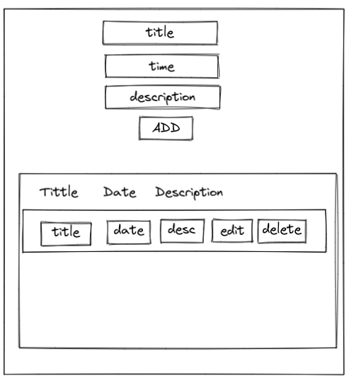
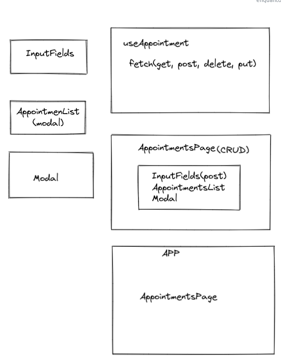

# Ik Appointments App - Frontend

Essa é uma proposta de solução para o desafio técnico do processo seletivo da empresa Ik Solution.

## Table of contents

- [Overview](#overview)
  - [The challenge](#the-challenge)
  - [Screenshot](#screenshot)
  - [Links](#links)
- [My process](#my-process)
  - [Built with](#built-with)
  - [What I learned](#what-i-learned)
  - [Continued development](#continued-development)
- [Author](#author)


## Overview

### The challenge

Usuários deveriam ser capazes de:

- Criar uma tarefa/appointment com título e data.
- Utilizar features de CRUD (criar, listar, atualizar e deletar).

### Screenshot of the prototype



### Screenshot of components structure



### Links

- Live Site URL: [Add live site URL here](https://appointments-ik-frontend.herokuapp.com/)

## My process

### Built with

- HTML5 markup
- CSS custom properties
- [React](https://reactjs.org/) - JS library
- [Styled-components](https://styled-components.com/) - Styled-Components

### What I learned

Com este projeto pude praticar minhas habilidades básicas de frontend, especialmente com React, integrando um backend.

code highlight:

```ts
useEffect(() => {
    setLoading(true);

    fetch('https://appointments-api-ik.herokuapp.com/appointments')
      .then((response) => response.json())
      .then((data) => setAppointments(data))
      .catch((error) => setError(error))
      .finally(() => setLoading(false));
  }, []);

  const createAppointment = (appointment) => {
    fetch(`https://appointments-api-ik.herokuapp.com/appointments`, {
      method: 'POST',
      body: JSON.stringify(appointment),
      headers: { 'Content-Type': 'application/json' },
    })
      .then((response) => response.json())
      .then((data) => {
        setAppointments([...appointments, data]);
      });
  };

  const updateAppointment = (appointment, editAppointment) => {
    fetch(`https://appointments-api-ik.herokuapp.com/appointments/${editAppointment.id}`, {
      method: 'PUT',
      headers: { 'Content-Type': 'application/json' },
      body: JSON.stringify(appointment),
    })
      .then((response) => response.json())
      .then((data) => {
        setAppointments(
          appointments.map((appt) => (appt.id !== editAppointment.id ? appt : appointment)),
        );
      });
  };

  const deleteAppointment = (id) => {
    fetch(`https://appointments-api-ik.herokuapp.com/appointments/${id}`, {
      method: 'DELETE',
    }).then(() => {
      setAppointments(appointments.filter((appt) => appt.id !== id));
    });
  };
}
```

### Backend

Esse projeto foi totalmente integrado com um backend criado do zero para ele, utilizando-se Node.js, com deploy no Heroku.

## Author

- Linkedin - [Gabriel Prates Peralta](https://www.linkedin.com/in/gabriel-pperalta/)